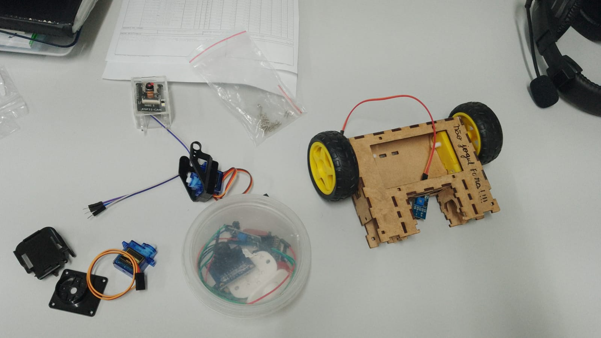
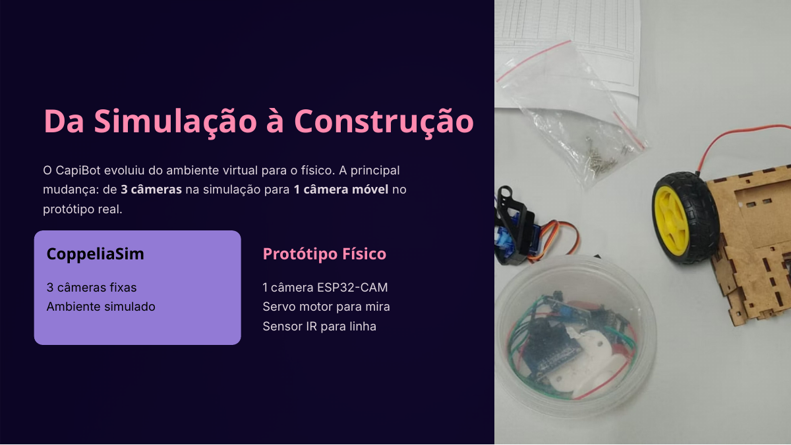

# CapiBot — robô seguidor de linha com ESP32-CAM

O **CapiBot** é um protótipo de robô autônomo desenvolvido para a disciplina de Robótica. A proposta geral do projeto é simular e prototipar uma solução de apoio à limpeza urbana: um robô capaz de percorrer trajetos definidos, identificar pontos de inspeção associados a bueiros e, em uma etapa futura, coletar pequenos resíduos.

Este repositório registra a parte física/embarcada do projeto: montagem do robô, eletrônica, testes de pinos, decisões de hardware e código atual do seguidor de linha com visão computacional na ESP32-CAM.



## Estado atual

A versão atual mais promissora é:

```text
src/CapiBot_v29_v4_gpio2_inv_final.ino
```

Ela é baseada na versão v4 do seguidor de linha, com correção de mapeamento dos motores e remoção do sensor IR da lógica final. O robô já demonstrou progresso real no seguimento de linha, mas ainda precisa de ajuste fino na classificação de curvas e na continuidade do movimento.

## Hardware usado

| Subsistema | Componente | Função no projeto |
|---|---|---|
| Controle e visão | ESP32-CAM AI Thinker | Captura imagem da pista e executa o código embarcado |
| Locomoção | Chassi 2 rodas + motores DC com redução | Tração diferencial |
| Acionamento | Ponte H HG7881/L9110 ou equivalente | Controle independente dos motores |
| Alimentação | Bateria 2S Li-ion + regulagem/USB em testes | Alimentação dos motores e da ESP32-CAM |
| Sensor removido | TCRT5000/IR | Foi testado, mas saiu da versão final por conflito elétrico/lógico |
| Maquete | Pista com linha | Representa ruas/rotas definidas entre pontos de inspeção |

## Pinagem final do robô

Depois dos testes de diagnóstico, o mapeamento final adotado foi:

```cpp
#define DIR_1 2
#define DIR_2 13

#define ESQ_1 14
#define ESQ_2 15
```

Interpretação física:

```text
Motor direito  = GPIO2 / GPIO13
Motor esquerdo = GPIO14 / GPIO15
IR             = removido
GPIO12         = não usar
GPIO16         = não usar com câmera
```

A inversão atual no código é:

```cpp
bool INVERTER_ESQ = true;
bool INVERTER_DIR = false;
bool INVERTER_CORRECAO = true;
```

## Por que GPIO12 e GPIO16 foram removidos?

Durante a integração, foram encontrados problemas de boot e instabilidade:

- **GPIO12** causou falhas de boot/leitura da flash quando conectado à ponte H. Por isso foi retirado do mapa de motores.
- **GPIO16** mostrou comportamento incompatível com a câmera/PSRAM da ESP32-CAM. O robô chegou a inicializar, mas reiniciava ou travava ao iniciar a rotina de visão.
- **GPIO2** foi adotado porque o sensor IR saiu da versão final, liberando o pino. O cuidado é que GPIO2 pode atrapalhar upload/boot se for puxado para nível inadequado. Na prática, se a gravação falhar, desconecte temporariamente o fio do GPIO2 da ponte H para gravar.

## Como gravar o código

Configuração usada na Arduino IDE:

```text
Board: AI Thinker ESP32-CAM
Upload Speed: 115200
Partition Scheme: Huge APP
Serial Monitor: 115200 baud
```

Procedimento:

```text
1. Desligar a alimentação dos motores.
2. Conectar FTDI à ESP32-CAM:
   FTDI 5V  -> 5V da ESP32-CAM
   FTDI GND -> GND da ESP32-CAM
   FTDI TX  -> U0R/RX da ESP32-CAM
   FTDI RX  -> U0T/TX da ESP32-CAM
3. Ligar IO0/GPIO0 ao GND.
4. Apertar RST.
5. Fazer upload do sketch.
6. Após gravar, remover IO0 do GND.
7. Apertar RST novamente.
8. Reconectar ponte/motores se algum fio tiver sido removido para gravação.
```

> Observação importante: o **GND comum** entre FTDI, ESP32-CAM, ponte H e bateria é obrigatório. Sem GND comum, a placa pode não responder ao upload ou aos comandos seriais.

## Lógica de visão computacional

A versão atual usa a ESP32-CAM para seguir uma linha preta sobre fundo claro. O fluxo principal é:

```text
1. Captura frame da câmera.
2. Usa imagem em tons de cinza.
3. Recorta uma região de interesse inferior da imagem.
4. Aplica limiarização automática inspirada em Otsu.
5. Divide a ROI em faixas horizontais.
6. Procura blocos escuros compatíveis com a linha.
7. Rejeita ruído, sombras laterais e manchas largas demais.
8. Calcula posição da linha próxima, média e distante.
9. Estima erro lateral e ângulo da linha.
10. Classifica o estado: reta, curva 45, curva 90 ou busca pendular.
11. Converte o controle em PWM para os motores.
```

Estados principais:

| Estado | Uso |
|---|---|
| `LINHA_RETA` | Linha relativamente centralizada |
| `CURVA_45_ESQUERDA` / `CURVA_45_DIREITA` | Correção moderada |
| `CURVA_90_ESQUERDA` / `CURVA_90_DIREITA` | Curva forte ou erro muito grande |
| `BUSCA_PENDULAR` | Linha perdida; robô tenta recuperar alternando lados |

## Ajustes importantes no código

Parâmetros úteis para ajuste fino:

```cpp
int BASE_RETA = 100;
int MAX_RETA  = 156;
int MIN_MOTOR = 84;

float KP_ERRO   = 0.98;
float KA_ANGULO = 1.08;
float KD_ERRO   = 0.26;
float SUAVIZACAO_CONTROLE = 0.40;

int LIM_CURVA_45_ERRO = 24;
int LIM_CURVA_45_ANG  = 30;
int LIM_CURVA_45_CTRL = 42;

int LIM_CURVA_90_ERRO = 50;
int LIM_CURVA_90_ANG  = 62;
int LIM_CURVA_90_CTRL = 76;
```

## Problemas resolvidos

- Identificação do mapeamento real dos motores.
- Correção da inversão do motor esquerdo.
- Remoção do GPIO12, que causava instabilidade no boot.
- Remoção do GPIO16, que gerava conflito com câmera/PSRAM.
- Remoção do IR da versão final.
- Ajuste do sinal de correção da câmera (`INVERTER_CORRECAO = true`).
- Uso do flash desligado para reduzir consumo e evitar interferência visual.

## Problemas ainda em ajuste

A versão atual é promissora, mas ainda apresenta:

- falsa identificação de curva 90 em alguns trechos;
- oscilação entre esquerda/direita em curvas;
- movimento em pequenos passos, com perda eventual da linha;
- necessidade de histerese para evitar troca de decisão a cada frame;
- necessidade de suavizar curvas 90, possivelmente removendo ré em curvas fortes.

## Estrutura sugerida do repositório

```text
.
├── README.md
├── src/
│   └── CapiBot_v29_v4_gpio2_inv_final.ino
├── docs/
│   ├── relatorio_geral_disciplina.md
│   └── relatorio_geral_disciplina.docx
├── assets/
│   ├── figures/
│   ├── fotos/
│   ├── videos/
│   ├── slides/
│   ├── kpi/
│   └── coppeliasim/
└── logs/
```

## Relação com a disciplina

O CapiBot começou como proposta de simulação no CoppeliaSim, usando linhas como ruas e pontos como bueiros. A etapa física simplificou o escopo para um robô seguidor de linha com ESP32-CAM, servindo como ponte entre a ideia de Shadow Digital/Gêmeo Digital e um protótipo real de robótica móvel.



## Créditos

Projeto desenvolvido pela equipe CapiBot na disciplina de Robótica.

Integrantes citados nos materiais do projeto: Arthur, Guilherme, Pedro, Vinícius Ribeiro e Vinicyus.

---
# Link do Relatório
> https://docs.google.com/document/d/1hx5jaxl3Kh5U8YLheNZ77OgSc7Q0BwdGaoZwEF5JD8M/edit?usp=sharing

---
# Link do Repositório
> https://github.com/Vjfrib/Elementos-da-Rob-tica

---
# Link dos demais documentos
> https://drive.google.com/drive/folders/1zWfY4u6Pp4PBYSidGEZoLEqJiD-sx8go?usp=sharing

---
---
